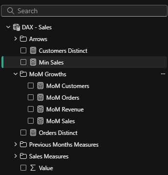

# Sobre o Projeto

### Fotos Adicionais

  
  

### Link do Dashboard: [Northwind traders](https://app.powerbi.com/view?r=eyJrIjoiM2Y4NWJmMTItZjYwNy00N2FhLTljMzYtMjYzY2E0MGZkYzJhIiwidCI6IjkxZmE3NDMzLWJkZmUtNDAxYS04NmY3LWYwZDI0OGNlMDgyNiJ9&pageName=7d007a0ad723ac2a2136)

## Objetivo

O objetivo principal deste dashboard é fornecer aos nossos executivos insights rápidos e acessíveis sobre o desempenho da empresa nas principais áreas de negócios. Especificamente, precisamos de um dashboard que acompanhe e visualize as seguintes métricas:

- **Tendências de Vendas:** 
- **Desempenho de Produtos:** 
- **Clientes Chave:** 
- **Custos de Envio:** 

# Etapas

### Tratamento dos Dados
- Criado uma conexão dos arquivos csv com o Power BI. Em seguida, usei o Power Query Editor para limpar os dados e fazer a análise de distribuição, qualidade e estrutura. 

### Modelagem dos Dados
- Neste etapa, criei as tabelas fato e suas dimensões, estabelecendo os relacionamentos entre elas.

### Criação das Medidas DAX
- Desenvolvimento de medidas DAX de forma a gerar insights é uma das etapas mais importantes da análise. Para aumentar a produtividade, criei uma tabela específica para as fórmulas DAX com pastas ordenando pelo tipo de use de cada uma das medidas.  

### Visualização dos Dados
- Com os dados já tratados e medidas criadas, desenvolvi os visuais mostrando padrões e insights alinhados com o objetivo do projeto.

# Insights

## Vendas 
- Analisando os dados de vendas, percebemos um crescimento gradual ao longo do período, com destaque para o aumento substancial a partir de 2014. A participação das vendas no total também segue uma tendência crescente, especialmente no início de 2015, atingindo seu pico em abril de 2015, com 9,78% das vendas totais.

- Em 2014, o desempenho foi bastante consistente, com alguns meses de destaque, como outubro e dezembro, que representaram 5,27% e 5,64%, respectivamente. Já em 2015, o mês de abril se destaca como o melhor mês de vendas até o momento, com o maior valor absoluto e a maior participação no total.

- Embora as vendas tenham mostrado um crescimento geral, o mês de Novembro de 2014 teve uma queda considerável, com apenas 3,44% das vendas totais, o que pode indicar uma sazonalidade ou algum fator específico que afetou negativamente os resultados.

- O panorama geral indica uma tendência positiva, mas com flutuações que podem refletir tanto a sazonalidade quanto fatores externos que impactaram as vendas em determinados meses.

## Desempenho dos Produtos

- O desempenho dos produtos mostra uma variação significativa. Alguns produtos se destacam, como o **Côte de Blaye**, com um volume de vendas muito alto (141.396,73) e um preço unitário elevado (245,93), o que indica ser um item de grande valor para os consumidores. Outros produtos, como o **Thüringer Rostbratwurst** e o **Raclette Courdavault**, também têm bom desempenho, com volumes de vendas consideráveis e preços unitários razoáveis, gerando uma boa margem de lucro.

- Por outro lado, alguns produtos apresentam vendas bem mais baixas. **Geitost**, por exemplo, teve um volume de vendas de apenas 1.648,13, com um preço unitário muito baixo (2,33), o que sugere que não está atraindo muitos consumidores. O **Chocolade** também teve vendas baixas, apesar de seu preço ser um pouco mais alto, o que indica que ele pode não estar sendo bem promovido ou que a demanda é limitada.

- Em geral, os produtos com bom desempenho têm um bom equilíbrio entre volume de vendas e custo de frete. Já os de baixo desempenho podem precisar de ajustes em suas estratégias de marketing, promoções ou até revisão no preço para aumentar a atratividade. Além disso, alguns produtos com vendas moderadas e preços baixos podem não gerar margem suficiente, o que pode ser um fator limitante. Para otimizar o desempenho, seria interessante revisar as estratégias de marketing e logística, visando reduzir os custos de frete e aumentar as vendas desses produtos.

## Desempenho dos Clientes

- A análise do desempenho dos clientes revela uma grande diversidade nas vendas entre diferentes países. O cliente Horst Kloss, da Alemanha, foi o que obteve o maior volume de vendas, com um total de 110.277,30, seguido de Roland Mendel da Áustria com 104.874,98. A maioria dos clientes mais destacados está localizada nos Estados Unidos e na Alemanha, o que sugere que esses países têm uma participação importante nas vendas. No entanto, é possível observar uma quantidade significativa de clientes com vendas mais baixas, com destaque para aqueles com vendas abaixo de 5.000, como o cliente "John Steel" com apenas 357,00 em vendas.

- Além disso, alguns clientes apresentaram um número reduzido de pedidos, o que pode indicar uma relação menos frequente com a empresa, mas com volumes de venda menores. Também é notável que há uma grande variedade de origens, com muitos países representados, como Brasil, França, México, Venezuela, entre outros. 

- Com base nesse padrão, parece que, enquanto a maioria dos clientes não tem vendas extremamente altas, há um grupo pequeno e seleto que contribui significativamente para as receitas. Para melhorar o desempenho global, poderia ser interessante trabalhar mais intensamente com clientes que possuem vendas menores, aumentando a frequência de compras e fidelização desses consumidores.

## Custos de Envio
- A análise dos dados de custo de envio revela que **Federal Shipping** frequentemente tem o maior valor de **frete** por pedido, o que pode indicar que está lidando com pedidos mais pesados ou de maior valor. No entanto, a variabilidade nos **dias de entrega** é alta, com alguns meses apresentando entregas rápidas e outros com prazos mais longos. Isso pode indicar uma estratégia focada em flexibilidade, mas com resultados menos consistentes.

- **Speedy Express**, por sua vez, tem uma performance mais focada em entregas rápidas, com **percentuais de entrega** elevados, mas o valor de **frete por pedido** é relativamente baixo. A empresa parece priorizar a agilidade nas entregas, o que pode ser um diferencial competitivo, embora com um custo mais baixo por remessa. No entanto, em alguns meses, o desempenho em termos de **frete** e **dias de entrega** diminui, sugerindo que talvez haja variações em sua capacidade de entrega.

- Já **United Package** se destaca pelo **volume de frete** em comparação às demais transportadoras, com uma média de **frete por pedido** competitiva. Embora os **dias de entrega** sejam geralmente moderados, a empresa mantém uma performance consistente, principalmente nos meses mais recentes, o que pode refletir uma estratégia de crescimento focada em maior volume de entregas.

- Em resumo, as três transportadoras têm abordagens distintas: **Federal Shipping** com foco em grandes volumes de frete, **Speedy Express** com entregas rápidas e menores valores, e **United Package** tentando equilibrar entre volume e frete.
